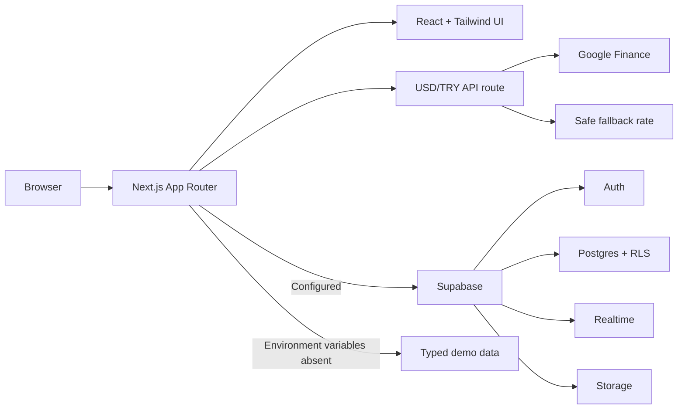

# Jamly

**A premium marketplace for beats, music services, and creator collaboration.**

Jamly brings the discovery experience of a beat marketplace together with the
structured service workflow of a freelance platform. Buyers can find beats,
vocals, lyrics, mixing, mastering, instrument work, and custom production;
creators can publish listings, present their portfolio, receive project requests,
and continue the conversation inside the platform.

Jamly is currently a production-oriented MVP. The marketplace, role-based auth,
Supabase data layer, tiered beat licensing, private delivery packages, order
requests, and Realtime messaging are implemented. Payments, escrow, payouts,
and service-order file delivery are intentionally outside the current release.

## Product Highlights

| Area | Capability |
| --- | --- |
| Discovery | Searchable and filterable Jam Place with category, genre, budget, BPM, and delivery signals |
| Jam Match | Guided project brief and intent-aware matching across listings and creators |
| Creator tools | Creator profile, portfolio, social links, listing upload, and creator dashboard |
| Buyer tools | Shortlist, buyer dashboard, order requests, and order detail views |
| Beat licensing | Fixed MP3, Unlimited, and Exclusive terms with creator-controlled pricing |
| Exclusive sale | Transactional marketplace removal that blocks every later license purchase |
| Messaging | Listing- and order-aware conversations with Supabase Realtime updates |
| Media | Public previews and tier-specific private delivery packages through Supabase Storage |
| Localization | Full Turkish and English interface support |
| Currency | USD and TRY display with a server-side USD/TRY rate endpoint and safe fallback |
| Resilience | Fully usable demo mode when Supabase environment variables are absent |
| Responsive UI | Premium dark interface with desktop navigation and an accessible mobile drawer |

## Core User Flows

### Buyer

1. Browse or filter listings in Jam Place.
2. Listen to audio previews and compare creator signals.
3. Use Jam Match to describe the project, budget, genre, and deadline.
4. Compare MP3, Unlimited, and Exclusive terms on the beat checkout.
5. Complete a license order and access its private delivery package.
6. Follow the order or continue the conversation from the buyer dashboard.

### Creator

1. Create an account with the `creator` role.
2. Complete the profile and add Spotify, Instagram, TikTok, YouTube,
   SoundCloud, or website links.
3. Upload a beat with three prices and tier-specific delivery packages, or publish a service.
4. Manage active listings and incoming requests from the creator dashboard.
5. Discuss briefs with buyers through Realtime conversations.

## Architecture



Jam Match is a deterministic intent-matching engine in the current MVP. It
scores category, genre, prompt terms, BPM, budget, deadline, and ready-made vs.
custom-work preferences. Its data contract is structured so the ranking layer
can later be replaced or enhanced by Supabase search, embeddings, or an AI model.

## Technology Stack

| Layer | Technology |
| --- | --- |
| Framework | Next.js 14, App Router |
| Language | TypeScript 5, strict mode |
| UI | React 18, Tailwind CSS 3 |
| Icons | Lucide React |
| Auth | Supabase Auth |
| Database | Supabase Postgres |
| Security | Supabase Row Level Security |
| Realtime | Supabase Realtime |
| Media storage | Supabase Storage |
| Package manager | npm with lockfile |
| Deployment | Netlify or Docker |

## Quick Start

### Prerequisites

- Node.js 20 or newer
- npm 10 or newer

### Run in demo mode

Demo mode requires no external service or credentials.

```bash
git clone <repository-url>
cd build-an-mvp-for-jamly-a
npm ci
npm run dev
```

Open [http://localhost:3000](http://localhost:3000).

### Run with Supabase

```bash
cp .env.example .env.local
```

Add your Supabase project values to `.env.local`, then start the app:

```bash
npm run dev
```

Never commit `.env`, `.env.local`, service-role keys, or private credentials.

## Runtime Modes

| Capability | Demo mode | Supabase mode |
| --- | --- | --- |
| Catalog and profiles | Typed local fixture data | Live Postgres data with demo fallback |
| Dashboards | Representative demo states | User-specific creator or buyer data |
| Authentication | Non-persistent demo experience | Supabase sessions and role-based redirects |
| Listing upload | Local file preview and demo feedback | Storage upload and Postgres insert for authenticated creators |
| Beat checkout | Interactive license comparison without persistence | Atomic license order with exclusive-sale locking |
| Delivery | Terms and file manifest preview | Private package access through 60-second signed URLs |
| Order requests | Explicit demo-mode response | Persisted service request for authenticated buyers and UUID listings |
| Messaging | Mock conversations | Persisted messages with Realtime subscriptions |

The application enters demo mode automatically when either public Supabase
environment variable is missing.

## Environment Variables

| Variable | Required | Description |
| --- | --- | --- |
| `NEXT_PUBLIC_SUPABASE_URL` | Supabase mode | Public Supabase project URL |
| `NEXT_PUBLIC_SUPABASE_ANON_KEY` | Supabase mode | Public Supabase anonymous key; RLS remains the authorization boundary |
| `APP_PORT` | Docker only | Host port mapped to the application; defaults to `3000` |

Use `.env.local` for local Next.js development. Docker Compose reads values
from `.env` or the shell environment. Netlify values belong in the site's
Environment variables settings.

## Supabase Setup

### New project

1. Create a Supabase project.
2. Open the Supabase SQL Editor.
3. Run [`supabase/schema.sql`](supabase/schema.sql).
4. Copy `.env.example` to `.env.local`.
5. Add the project URL and anonymous key.
6. Restart the development server.

The schema creates:

- `profiles`
- `listings`
- `order_requests`
- `conversations`
- `messages`
- `message_attachments`
- `listing-covers`, `audio-previews`, and private `license-deliverables` Storage buckets
- RLS policies, indexes, triggers, and Realtime publications

### Existing project

If an older Jamly schema is already installed, apply the relevant migrations in
date order instead of re-running the complete schema:

1. [`supabase/migrations/20260629_add_conversations.sql`](supabase/migrations/20260629_add_conversations.sql)
2. [`supabase/migrations/20260707_add_beat_license_tiers.sql`](supabase/migrations/20260707_add_beat_license_tiers.sql)

The licensing migration backfills prices for existing beat rows, adds the
transactional purchase function, and creates the private delivery bucket. Existing
beats still require their three delivery packages before a live purchase can succeed.

### Authentication configuration

Set the Supabase Auth site URL and allowed redirect URLs for every environment:

```text
Local:      http://localhost:3000
Production: https://your-domain.example
```

Jamly stores `creator` or `buyer` in the user's profile and redirects successful
sign-ins to the matching dashboard.

## Data Model

| Table | Responsibility |
| --- | --- |
| `profiles` | Identity, role, creator presentation, specialties, and social links |
| `listings` | Beat and service metadata, three beat prices, exclusive state, private package paths, and public media |
| `order_requests` | Buyer brief, selected license tier, locked purchase price, terms version, and order status |
| `conversations` | Buyer/creator thread with optional listing or order context |
| `messages` | Text messages, read state, sender, and timestamps |
| `message_attachments` | Future-ready file metadata associated with messages |

## Security Model

- Row Level Security is enabled for every application table.
- Users can only read conversations and messages in which they participate.
- Message inserts require `sender_id = auth.uid()`.
- Buyers can only create order requests for themselves.
- Only authenticated creators can create or update their own listings.
- Beat license purchases use a row lock so an Exclusive sale and another license cannot race.
- Exclusive purchase atomically marks the listing sold and removes it from public discovery.
- Storage upload policies require an authenticated creator profile.
- Buyers can read only the private folder matching the tier recorded on their order.
- Public clients use only the Supabase anonymous key; no service-role key is
  required by the application.
- Public listing media is readable, while uploads remain policy-controlled.

Before production launch, review RLS policies in a staging Supabase project and
add automated authorization tests for every role and table.

## Available Routes

| Route | Purpose |
| --- | --- |
| `/` | Product home and featured marketplace content |
| `/marketplace` | Jam Place search, filters, and listing discovery |
| `/jam-match` | Guided project brief and matching results |
| `/creators/[handle]` | Creator profile, portfolio, and social presence |
| `/listing/[id]` | Listing details, audio preview, and request actions |
| `/checkout/[id]` | Three-tier beat license comparison and order confirmation |
| `/messages` | Conversation list and active chat workspace |
| `/orders/[id]` | Participant-only order brief, status, and messages |
| `/dashboard/creator` | Creator listings and incoming order requests |
| `/dashboard/buyer` | Buyer requests and saved work |
| `/upload` | Authenticated creator listing upload |
| `/auth/sign-in` | Sign-in flow |
| `/auth/sign-up` | Role-aware registration flow |
| `/api/exchange-rate` | Server-side USD/TRY rate response with timeout and fallback |

## Project Structure

```text
src/
├── app/                  Next.js routes, layouts, and API handlers
├── components/           Reusable UI and feature components
└── lib/                  Data access, Supabase clients, hooks, i18n, and matching
supabase/
├── migrations/           Incremental database migrations
└── schema.sql             Complete schema for a new project
Dockerfile                 Production multi-stage Node image
docker-compose.yml         Local production-style container orchestration
netlify.toml               Netlify build and Next.js plugin configuration
```

## Development Commands

| Command | Purpose |
| --- | --- |
| `npm run dev` | Start the local Next.js development server |
| `npm run typecheck` | Run strict TypeScript validation without emitting files |
| `npm run lint` | Run ESLint across the project |
| `npm run build` | Create and validate the optimized production build |
| `npm run start` | Run the previously built production server |

Recommended quality gate before every merge:

```bash
npm run typecheck
npm run lint
npm run build
```

An automated unit/integration test suite is not included yet. Type checking,
linting, production build validation, and focused browser verification are the
current quality gates.

## Docker

The repository includes a multi-stage Node 20 Alpine image, a non-root runtime
user, health checks, restart policy, named network, and persistent Next.js cache.

```bash
cp .env.example .env
docker compose build
docker compose up -d
docker compose ps
```

Open [http://localhost:3000](http://localhost:3000), or use the port configured
through `APP_PORT`.

Useful commands:

```bash
docker compose logs -f jamly-web
docker compose down
```

Docker Compose runs the Jamly web application only. Supabase Auth, Postgres,
Realtime, and Storage must come from a hosted Supabase project or a separately
managed local Supabase stack.

## Netlify Deployment

The checked-in [`netlify.toml`](netlify.toml) defines the production settings:

```text
Build command:     npm run build
Publish directory: .next
Node version:      20
Plugin:            @netlify/plugin-nextjs
```

Deployment flow:

1. Push the repository to GitHub.
2. In Netlify, select **Add new site → Import an existing project**.
3. Connect the GitHub repository.
4. Confirm the build settings above.
5. Add Supabase variables in **Site configuration → Environment variables**.
6. Deploy and add the production URL to Supabase Auth redirect settings.

Jamly uses Next.js App Router and is not a static SPA. Do not add a catch-all
`/* → /index.html` redirect; the Netlify Next.js plugin manages routes and server
functions.

## Current Scope and Roadmap

The current release deliberately focuses on discovery, trust, project intent,
and communication. The next production milestones are:

1. Payment provider integration, escrow, refunds, and creator payouts.
2. Custom offers and service-order conversion from conversations.
3. Service-order file delivery and message attachment UI.
4. Notifications, typing indicators, online presence, block, and report tools.
5. Moderation, observability, audit logs, and automated end-to-end tests.
6. Search indexing and a learned or embedding-assisted Jam Match ranking layer.

---

Built as a clean, extensible foundation for independent artists, producers, and
music freelancers who need a better way to discover, brief, and collaborate.
