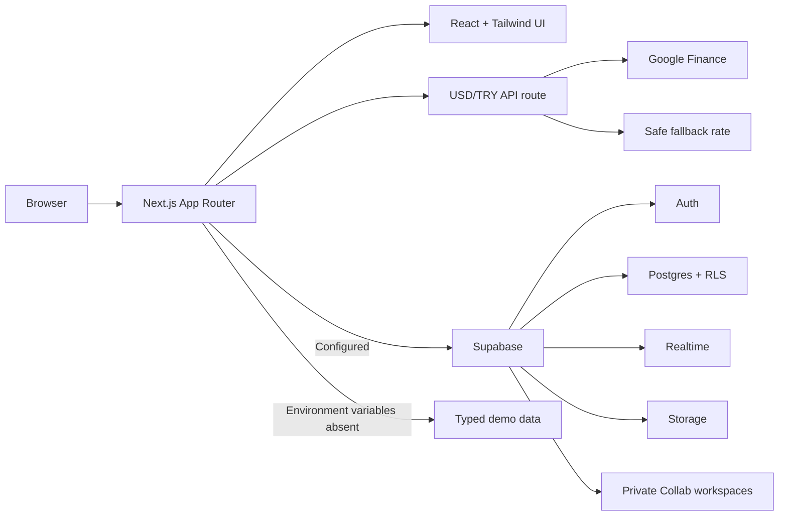

# Jamly

**A premium marketplace for beats, music services, and creator collaboration.**

Jamly brings the discovery experience of a beat marketplace together with the
structured service workflow of a freelance platform. Buyers can find beats,
vocals, lyrics, mixing, mastering, instrument work, and custom production;
creators can publish listings, present their portfolio, receive project requests,
and continue the conversation inside the platform.

Jamly is currently a production-oriented MVP. The marketplace, unified account auth,
Supabase data layer, tiered beat licensing, private delivery packages, order
requests, Realtime messaging, and participant-only collaboration workspaces are implemented. Payments, escrow, payouts,
and service-order file delivery are intentionally outside the current release.

Post-beta hardening and product expansion are tracked in
[ROADMAP.md](./ROADMAP.md).

## Product Highlights

| Area | Capability |
| --- | --- |
| Discovery | Searchable and filterable Jam Place with category, genre, budget, BPM, and delivery signals |
| Jam Match | Guided project brief and intent-aware matching across listings and creators |
| Creator tools | Creator profile, portfolio, social links, listing upload, and creator dashboard |
| Buyer tools | Shortlist, buyer dashboard, order requests, and order detail views |
| Beat licensing | Fixed MP3, Unlimited, and Exclusive terms with creator-controlled pricing |
| Exclusive sale | Transactional marketplace removal that blocks every later license purchase |
| Messaging | Listing- and order-aware conversations with Supabase Realtime updates |
| Collab workspace | Private projects, invitations, revenue shares, file versions, waveform comments, and live notifications |
| Media | Public previews and tier-specific private delivery packages through Supabase Storage |
| Localization | Full Turkish and English interface support |
| Currency | USD and TRY display with a server-side USD/TRY rate endpoint and safe fallback |
| Resilience | Fully usable demo mode when Supabase environment variables are absent |
| Admin | Server-verified admin dashboard for user status, listings, orders, reports, and skills |
| Responsive UI | Premium dark interface with desktop navigation and an accessible mobile drawer |

## Core User Flows

### Account

1. Browse or filter listings in Jam Place.
2. Listen to audio previews and compare creator signals.
3. Use Jam Match to describe the project, budget, genre, and deadline.
4. Compare MP3, Unlimited, and Exclusive terms on the beat checkout.
5. Publish your own beat, service, or custom production offer from the same account.
6. Complete the profile and add Spotify, Instagram, TikTok, YouTube,
   SoundCloud, or website links.
7. Follow requests, orders, and conversations from the unified dashboard.

## Architecture


```mermaid
flowchart LR
    Browser["Browser"] --> Next["Next.js App Router"]
    Next --> UI["React + Tailwind UI"]
    Next --> FX["USD/TRY API route"]
    FX --> Google["Google Finance"]
    FX --> Fallback["Safe fallback rate"]
    Next -->|"Configured"| Supabase["Supabase"]
    Supabase --> Auth["Auth"]
    Supabase --> Postgres["Postgres + RLS"]
    Supabase --> Realtime["Realtime"]
    Supabase --> Storage["Storage"]
    Supabase --> Collab["Private Collab workspaces"]
    Next -->|"Environment variables absent"| Demo["Typed demo data"]
```

Jam Match is a deterministic intent-matching engine in the current MVP. It
scores category, genre, prompt terms, BPM, budget, deadline, and ready-made vs.
custom-work preferences. Its data contract is structured so the ranking layer
can later be replaced or enhanced by Supabase search, embeddings, or an AI model.

## Technology Stack

| Layer | Technology |
| --- | --- |
| Framework | Next.js 16, App Router |
| Language | TypeScript 5, strict mode |
| UI | React 19, Tailwind CSS 3 |
| Icons | Lucide React |
| Auth | Supabase Auth |
| Database | Supabase Postgres |
| Security | Supabase Row Level Security |
| Realtime | Supabase Realtime |
| Media storage | Supabase Storage |
| Package manager | npm with lockfile |
| Deployment | Vercel, Docker, or Windows/IIS reverse proxy |

## Quick Start

### Prerequisites

- Node.js 24.x
- npm 10 or newer

### Run in demo mode

Demo mode requires no external service or credentials.

```bash
git clone <repository-url>
cd JAMLY
npm ci
npm run dev
```

Open [http://localhost:3000](http://localhost:3000).

### Run with Supabase

```bash
cp .env.example .env.local
```

Add your Supabase project values to `.env.local`, then start the app:

```bash
npm run dev
```

Never commit `.env`, `.env.local`, service-role keys, or private credentials.

## Runtime Modes

| Capability | Demo mode | Supabase mode |
| --- | --- | --- |
| Catalog and profiles | Typed local fixture data | Live Postgres data with demo fallback |
| Dashboards | Representative demo states | User-specific buying and selling data |
| Authentication | Non-persistent demo experience | Supabase sessions and unified account redirects |
| Listing upload | Local file preview and demo feedback | Storage upload and Postgres insert for authenticated accounts |
| Beat checkout | Interactive license comparison without persistence | Atomic license order with exclusive-sale locking |
| Delivery | Terms and file manifest preview | Private package access through 60-second signed URLs |
| Order requests | Explicit demo-mode response | Persisted service request for authenticated buyers and UUID listings |
| Messaging | Mock conversations | Persisted messages with Realtime subscriptions |
| Collaboration | Requires Supabase | Private projects, versioned files, timestamp comments, notifications, and revenue split records |

The application enters demo mode automatically when public Supabase environment
variables are missing, placeholder values, invalid, or unreachable.

## Environment Variables

| Variable | Required | Description |
| --- | --- | --- |
| `NEXT_PUBLIC_SUPABASE_URL` | Supabase mode | Public Supabase project URL |
| `NEXT_PUBLIC_SUPABASE_ANON_KEY` | Supabase mode | Public Supabase publishable/anonymous key; RLS remains the authorization boundary |
| `JAMLY_DEPLOYMENT` | No | Optional `/api/health` label, for example `self-hosted` |
| `APP_PORT` | Docker only | Host port mapped to the application; defaults to `3000` |

Use `.env.local` for local Next.js development and Windows/IIS self-hosting.
Docker Compose reads values from `.env` or the shell environment. Vercel values
belong in the project's Environment Variables settings.

## Supabase Setup

### New project

1. Create a Supabase project.
2. Open the Supabase SQL Editor.
3. Run [`supabase/schema.sql`](supabase/schema.sql).
4. Run the post-schema migrations listed in
   [`NEW_VDS_SETUP_WINDOWS.md`](NEW_VDS_SETUP_WINDOWS.md).
5. Copy `.env.example` to `.env.local`.
6. Add the project URL and publishable/anonymous key.
7. Rebuild/restart the app.

The base schema creates:

- `profiles`
- `listings`
- `order_requests`
- `conversations`
- `messages`
- `message_attachments`
- `collab_projects`, `collab_participants`, `collab_versions`, and `collab_comments`
- `notifications` and `revenue_splits`
- `listing-covers`, `profile-media`, `audio-previews`, and private `license-deliverables` Storage buckets
- private `collab-files` Storage bucket
- RLS policies, indexes, triggers, and Realtime publications

### Existing project

If an older Jamly schema is already installed, apply the relevant migrations in
dependency order instead of re-running the base schema file:

1. [`supabase/migrations/20260629_add_conversations.sql`](supabase/migrations/20260629_add_conversations.sql)
2. [`supabase/migrations/20260707_add_beat_license_tiers.sql`](supabase/migrations/20260707_add_beat_license_tiers.sql)
3. [`supabase/migrations/20260712_unify_account_capabilities.sql`](supabase/migrations/20260712_unify_account_capabilities.sql)
4. [`supabase/migrations/20260715_username_policy.sql`](supabase/migrations/20260715_username_policy.sql)
5. [`supabase/migrations/20260731_protect_founder_headline.sql`](supabase/migrations/20260731_protect_founder_headline.sql)
6. [`supabase/migrations/20260801_ensure_listing_storage.sql`](supabase/migrations/20260801_ensure_listing_storage.sql)
7. [`supabase/migrations/20260809_admin_and_platform_config.sql`](supabase/migrations/20260809_admin_and_platform_config.sql)
8. [`supabase/migrations/20260811_add_collaboration_workspace.sql`](supabase/migrations/20260811_add_collaboration_workspace.sql)
9. [`supabase/migrations/20260811_add_collaboration_revenue.sql`](supabase/migrations/20260811_add_collaboration_revenue.sql)
10. [`supabase/migrations/20260811_add_profile_follows.sql`](supabase/migrations/20260811_add_profile_follows.sql)
11. [`supabase/migrations/20260811_tighten_collaboration_rls.sql`](supabase/migrations/20260811_tighten_collaboration_rls.sql)
12. [`supabase/migrations/20260813_security_hardening.sql`](supabase/migrations/20260813_security_hardening.sql)
13. [`supabase/migrations/20260813_rate_limiting.sql`](supabase/migrations/20260813_rate_limiting.sql)
14. [`supabase/migrations/20260813_waitlist.sql`](supabase/migrations/20260813_waitlist.sql)
15. [`supabase/migrations/20260813_badges.sql`](supabase/migrations/20260813_badges.sql)
16. [`supabase/migrations/20260813_admin_rbac_audit.sql`](supabase/migrations/20260813_admin_rbac_audit.sql)
17. [`supabase/migrations/20260813_email_outbox.sql`](supabase/migrations/20260813_email_outbox.sql)
18. [`supabase/migrations/20260813_payments.sql`](supabase/migrations/20260813_payments.sql)
19. [`supabase/migrations/20260815_validate_payment_amount.sql`](supabase/migrations/20260815_validate_payment_amount.sql)

The licensing migration backfills prices for existing beat rows, adds the
transactional purchase function, and creates the private delivery bucket. Existing
beats still require their three delivery packages before a live purchase can succeed.

### Authentication configuration

Set the Supabase Auth site URL and allowed redirect URLs for every environment:

```text
Local:      http://localhost:3000
Production: https://your-domain.example
```

Jamly uses one account model. The legacy `profile_role` enum remains in the
database for compatibility, but it is no longer used as a hard product gate.
Successful sign-ins redirect to `/dashboard`.

### Admin access

The admin dashboard lives at `/admin`. It is visible in the account menu only
after `is_admin` confirms membership in `admin_accounts`, and every `/api/admin/*`
route repeats the same server-side check with the current bearer token.
The waitlist console includes a pre-register pipeline snapshot for total demand,
recent joins, creator/buyer intent, referrals, invites, conversions, and flagged
entries.

For a fresh database, `supabase/schema.sql` includes the base admin tables,
reports, platform skills, account status controls, and initial skill seeds.
The RBAC/audit migration upgrades that surface with admin roles and capability
checks. If no super admin exists after signup, insert the intended owner into
`admin_accounts` as `super_admin` from the Supabase SQL Editor.

## Data Model

| Table | Responsibility |
| --- | --- |
| `profiles` | Identity, public presentation, specialties, and social links |
| `listings` | Beat and service metadata, three beat prices, exclusive state, private package paths, and public media |
| `order_requests` | Buyer brief, selected license tier, locked purchase price, terms version, and order status |
| `conversations` | Buyer/creator thread with optional listing or order context |
| `messages` | Text messages, read state, sender, and timestamps |
| `message_attachments` | Future-ready file metadata associated with messages |
| `collab_projects` | Participant-only project workspace with optional listing linkage |
| `collab_participants` | Invitations, project roles, and validated revenue shares |
| `collab_versions` | Private Storage paths and version notes |
| `collab_comments` | Thread-ready timestamp comments attached to a version |
| `notifications` | Realtime invitation, version, and comment notifications |
| `revenue_splits` | Immutable allocation records created when a linked order is delivered |
| `admin_accounts` | Server-side admin membership and role metadata |
| `reports` | User, listing, order, and message reports for moderation workflows |
| `platform_skills` | Admin-managed skill/category configuration seeds |
| `platform_settings` | Future-ready key/value platform configuration |

## Security Model

- Row Level Security is enabled for every application table.
- Users can only read conversations and messages in which they participate.
- Message inserts require `sender_id = auth.uid()`.
- Authenticated users can create order requests for themselves.
- Authenticated users can create or update their own listings.
- Beat license orders are created unpaid; settled payments unlock delivery.
- A settled Exclusive payment marks the listing sold and removes it from public discovery.
- Storage upload policies require an authenticated account and owner folder isolation.
- Buyers can read only paid private delivery folders matching the tier recorded on their order.
- Admin APIs require a valid Supabase session bearer token and an `admin_accounts`
  membership check before returning moderation data.
- Profile account status changes are protected by RLS, trigger checks, and the
  `admin_set_profile_status` RPC.
- External social links are normalized and restricted to `http` and `https`.
- Security headers set a baseline CSP, frame protection, MIME sniffing
  protection, referrer policy, and permissions policy for every route.
- Public clients use only the Supabase publishable/anonymous key. Server-only
  payment settlement uses the service-role key when that path is enabled.
- Public listing media is readable, while uploads remain policy-controlled.
- Collab files are private and can only be read or uploaded by the owner and accepted participants.
- Revenue shares are constrained to 100% in both the UI and PostgreSQL triggers.

Before production launch, review RLS policies in a staging Supabase project and
add automated authorization tests for every role and table.

## Available Routes

| Route | Purpose |
| --- | --- |
| `/` | Product home and featured marketplace content |
| `/marketplace` | Jam Place search, filters, and listing discovery |
| `/jam-match` | Guided project brief and matching results |
| `/creators/[handle]` | Creator profile, portfolio, and social presence |
| `/listing/[id]` | Listing details, audio preview, and request actions |
| `/checkout/[id]` | Three-tier beat license comparison and order confirmation |
| `/messages` | Conversation list and active chat workspace |
| `/orders/[id]` | Participant-only order brief, status, and messages |
| `/collab` | Active projects, pending invitations, and completed collaboration workspaces |
| `/collab/new` | Authenticated project creation with optional listing linkage |
| `/collab/[projectId]` | Participants, revenue shares, versions, waveform comments, and uploads |
| `/dashboard/creator` | Creator listings and incoming order requests |
| `/dashboard/buyer` | Buyer requests and saved work |
| `/upload` | Authenticated creator listing upload |
| `/admin` | Admin console for users, listings, orders, reports, and platform skills |
| `/auth/sign-in` | Sign-in flow |
| `/auth/sign-up` | Role-aware registration flow |
| `/api/health` | Deployment, build, and Supabase readiness check without exposing secrets |
| `/api/admin/*` | Bearer-token protected admin data and moderation endpoints |
| `/api/exchange-rate` | Server-side USD/TRY rate response with timeout and fallback |

## Project Structure

```text
src/
├── app/                  Next.js routes, layouts, and API handlers
├── components/           Reusable UI and feature components
├── lib/                  Data access, Supabase clients, hooks, i18n, and matching
└── proxy.ts              Next 16 Proxy for Supabase session refresh
supabase/
├── migrations/           Incremental database migrations
└── schema.sql             Base schema for a new project
Dockerfile                 Production multi-stage Node image
docker-compose.yml         Local production-style container orchestration
vercel.json                Vercel build command and Next.js project hints
NEW_VDS_SETUP_WINDOWS.md   Windows Server 2022 + IIS + Supabase runbook
```

## Development Commands

| Command | Purpose |
| --- | --- |
| `npm run dev` | Start the local Next.js development server |
| `npm run typecheck` | Run strict TypeScript validation without emitting files |
| `npm run lint` | Run ESLint across the project |
| `npm run test` | Run focused Node-based regression tests for matching, config, and sanitization |
| `npm run build` | Create and validate the optimized production build |
| `npm run start` | Run the previously built production server |
| `npm run retention:dry-run` | Inspect Supabase retention cleanup counts without deleting rows or writing a DB run log |
| `npm run retention:dry-run:recorded` | Inspect retention cleanup counts and write a dry-run DB run log for ops health |
| `npm run retention:execute` | Execute the guarded retention cleanup and write a local JSON report |
| `npm run storage:audit` | Inspect Supabase Storage references and old orphan candidates without deleting files |
| `npm run storage:prune` | Delete only old orphan Supabase Storage objects after the same reference audit, guarded by confirmation |
| `npm run smoke:admin-panel` | Verify a temporary admin can sign in, open admin UI, read retention controls, and that pre-register blocks admin APIs |
| `npm run smoke:beta-gate` | Verify a non-admin, non-allowlisted auth account is redirected back to pre-register |
| `npm run smoke:public` | Verify live public routing, pre-register UI, mini-games, safe waitlist submission/rate-limit behavior, and anonymous admin guard |
| `npm run ops:check` | Verify Windows service and Jamly scheduled task health on the VDS |
| `npm run smoke:prune-artifacts` | Inspect local smoke, retention, and storage audit artifacts that would be pruned from `work/` |
| `npm run smoke:prune-artifacts:execute` | Delete old or over-budget local smoke/report artifacts |

Recommended quality gate before every merge:

```bash
npm run typecheck
npm run lint
npm run test
npm run build
```

The current automated tests cover the shared marketplace config, Jam Match
regressions, founder headline policy, and social-link URL sanitization.

## Supabase Verification And Schema Apply

Check whether the configured Supabase project is ready:

```bash
npm run supabase:check
```

Expected live result:

```json
{
  "ok": true,
  "auth": "ready",
  "database": "ready",
  "storage": "ready"
}
```

For an empty Supabase project, if the result says `schema_missing`, apply the
base schema with a direct Supabase Postgres connection string:

```bash
SUPABASE_DATABASE_URL="postgresql://postgres.<project-ref>:<password>@aws-0-<region>.pooler.supabase.com:5432/postgres?sslmode=require" npm run supabase:apply-schema
```

Then apply the post-schema migrations from
[`NEW_VDS_SETUP_WINDOWS.md`](NEW_VDS_SETUP_WINDOWS.md). For production, the
Supabase SQL Editor is preferred for the first launch because the required
order is explicit and each error is visible.

Use the database password or connection string from Supabase Dashboard. Do not
commit this value, and do not put it in Vercel frontend environment variables.

## Docker

The repository includes a multi-stage Node 24 Alpine image, a non-root runtime
user, health checks, restart policy, named network, and persistent Next.js cache.

```bash
cp .env.example .env
docker compose build
docker compose up -d
docker compose ps
```

Open [http://localhost:3000](http://localhost:3000), or use the port configured
through `APP_PORT`.

Useful commands:

```bash
docker compose logs -f jamly-web
docker compose down
```

Docker Compose runs the Jamly web application only. Supabase Auth, Postgres,
Realtime, and Storage must come from a hosted Supabase project or a separately
managed local Supabase stack.

## Windows/IIS Deployment

For `getjamly.com` on Windows Server 2022, use
[`NEW_VDS_SETUP_WINDOWS.md`](NEW_VDS_SETUP_WINDOWS.md). It runs Next.js as a
local Node service and uses IIS only as the public reverse proxy and TLS layer.

## Vercel Deployment

Jamly is intended to run on Vercel for production previews and sharing. The
checked-in [`vercel.json`](vercel.json) keeps the project aligned with Vercel's
Next.js runtime:

```text
Build command:     npm run build
Install command:   npm ci
Framework preset:  Next.js
Output directory:  Managed by Vercel
```

Deployment flow:

1. Push the repository to GitHub.
2. In Vercel, select **Add New → Project**.
3. Connect the GitHub repository.
4. Confirm the Next.js preset and build settings above.
5. Add Supabase variables in **Project Settings → Environment Variables** for
   Production, Preview, and Development as needed.
6. Deploy and add the production URL to Supabase Auth redirect settings.
7. Open `/api/health` on the deployed URL. `supabase.status` should be `ready`
   before testing live auth, uploads, messages, or orders.

Jamly uses Next.js App Router and is not a static SPA. Do not configure static
SPA rewrites such as `/* → /index.html`; Vercel handles App Router routes, API
routes, and server-rendered pages automatically.

If `/api/health` returns `schema_missing`, the Vercel integration is fine but
[`supabase/schema.sql`](supabase/schema.sql) still needs to be applied in the
Supabase SQL Editor.

## Current Scope and Roadmap

The current release deliberately focuses on discovery, trust, project intent,
and communication. The next production milestones are:

1. Payment provider integration, escrow, refunds, and creator payouts.
2. Custom offers and service-order conversion from conversations.
3. Service-order file delivery and message attachment UI.
4. Notifications, typing indicators, online presence, block, and richer report tools.
5. Moderation mutations for listings and orders, observability, audit logs, and automated end-to-end tests.
6. Search indexing and a learned or embedding-assisted Jam Match ranking layer.

See [`docs/system-audit-20260809.md`](docs/system-audit-20260809.md) for the
latest full-system audit and validation report.

---

Built as a clean, extensible foundation for independent artists, producers, and
music freelancers who need a better way to discover, brief, and collaborate.
